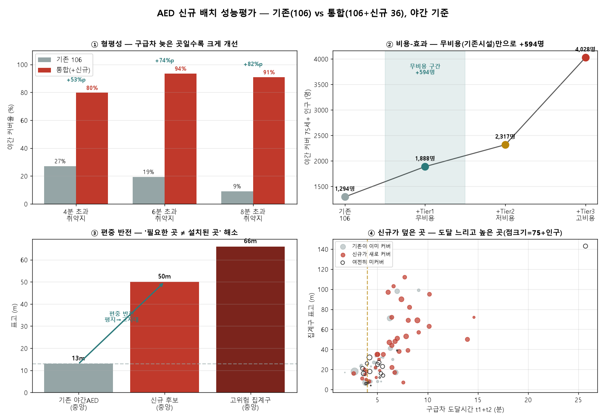
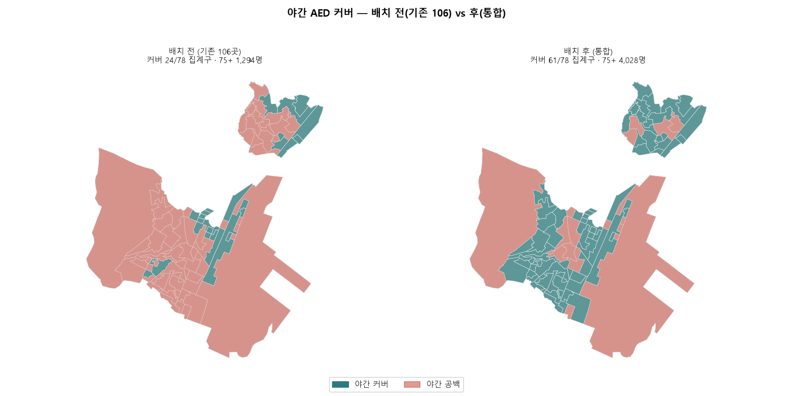

# 07. 성능평가 — "15개 놓으면 얼마나 좋아지는가"

[06. AED 접근성 배치](06_AED_접근성_배치.md)는 후보지를 *선정*했다. 이 문서는 그 배치가
**실제로 얼마나 개선을 만드는지**를 정량화한다. 자문의견서가 "성능평가에서 가장 중요"라 지적한
**반사실(counterfactual) 검증** — 설치 전(기존 AED만) vs 후(기존+신규)의 차이 — 에 답한다.

> 입력: `outputs/aed_donggu.csv`(기존 106곳, 운영시간 포함) · `data/output/AED_신규배치_접근성.csv`(신규 36) · `집계구별_출동시간_지연.csv`
> 재현: `python code/scripts/평가_탐색계산.py` → `평가_시각화.py`

---

## 1. 왜 다시 검증하는가 — 이전 검증의 한계

docs/06까지의 "검증"은 두 가지 약점이 있었다(자문 지적).

1. **자기비교였다.** "거리기준 vs 경사기준 배분이 86% vs 87%로 유사"는 *견고성*이지 *정확성*이 아니다. 두 방법이 `f_age`를 공유하므로 사실상 자기 자신과 비교한 셈.
2. **기존 AED를 반영하지 못했다.** docs/06은 `aed_donggu.csv`가 로컬에 없어 기존 106곳을 차감하지 못하고 "신규만으로 28.5%"를 냈다. 이는 개선량이 아니다.

본 문서는 **기존 AED 106곳을 baseline으로 삼아**, 신규 배치의 *순 개선량*을 측정한다. (106곳은 공공데이터포털 실물, 개인정보 제거·운영시간 포함본을 사용)

### 1-1. README 반사실과의 관계 (중복 아님, 보완)

README 3.2의 반사실 검증(설치 전후 제세동시간 6.30→4.29분, 골든타임 커버 22.5→54.7%)과 본 문서는 **묻는 질문이 다르다.**

| | README 반사실 | 본 문서(docs/07) |
|:---|:---|:---|
| baseline | AED가 **아예 없을 때**(구급차만) | **기존 AED 106곳이 있을 때** |
| 지표 | 제세동까지 **시간 단축**(분) | **커버 인구·형평성·비용**(명·%p) |
| 답하는 것 | "AED가 있으면 얼마나 빨라지나" | "기존 대비 신규가 순수하게 얼마나 더 덮나" |

두 관점은 상호보완이다. README는 *AED라는 수단의 가치*를, 본 문서는 *기존 대비 신규 배치의 증분 가치와 형평성*을 잰다. 특히 본 문서는 docs/06이 못 한 **기존 106곳 반영**을 완성한다.

---

## 2. 방법 — 커버 정의와 역할 분리

### 2-1. 커버 = 골든타임 도보 왕복 (경사 페널티 배제)

시민이 AED를 가지러 갔다 오는 것은 **보행**이다. 그런데 보행 경사계수를 실측할 데이터가 없다(50m 간격 보행실측 부재). 자동차용 계수(b_up, docs/05)를 사람에게 적용할 근거가 없으므로, **경사 페널티 계수를 쓰지 않는다.**

대신 두 가지 물리적 근거만 사용한다.

```
① 골든타임 왕복 거리:  도보 왕복시간 = 2 × (도로거리 / v_walk) ≤ T_gold
     → 수평 커버반경 R = v_walk · T_gold · 60 / 2 / τ ≈ 120m
        (T_gold=4분, v_walk=1.3 m/s, τ=1.3 우회율)
② 표고차 빗변보정:     d_eff = √(수평거리² + 표고차²)     ← 순수 기하, 검증 불필요
```

빗변보정은 "경사면의 실제 이동거리는 빗변"이라는 기하 사실만 쓴다(경사 모델이 아님). 이로써 *"고지대도 평지처럼 커버된다"* 는 과대평가를 막으면서, 검증 불가한 계수는 배제한다.

### 2-2. 역할 분리 — 자동차는 경사, 사람은 기하

| 단계 | 이동 주체 | 경사 처리 | 근거 |
|:---|:---|:---|:---|
| 취약도 판정(수요·도달지연) | 구급차 | 페널티 O (b_up, 자동차 실측) | docs/05 네비 실측 |
| **커버 판정(AED 접근)** | **사람(보행)** | **빗변보정만(계수 X)** | 보행 경사 실측 없음 |

단위도 통일했다. 문제정의의 취약도가 "구급차 **4분** 초과"이므로, 커버도 "도보 **4분** 왕복"으로 맞췄다. → *"구급차 4분 초과 지역을 AED 도보 4분으로 메운다"* 는 대칭 논리.

### 2-3. 비교 상태

```
A (기존):  기존 AED 106곳만  (야간 접근 60곳 / 주간 46곳)
C (통합):  기존 106 + 신규 36
개선량 Δ = C − A         (주간·야간 각각)
```

---

## 3. 결과



### 3-1. 커버 인구·위험도 (P1·P2)

75세+ 총 5,022명 기준. 위험도(무차원)와 인구(명)는 별도 제시한다.

| 상태 | 집계구 | 75세+ 커버 | 위험도 합 |
|:---|---:|---:|---:|
| A 기존·주간 | 39/78 | 2,346명 (46.7%) | 11.15 |
| A 기존·야간 | 24/78 | 1,294명 (25.8%) | 6.02 |
| C 통합·주간 | 62/78 | 4,126명 (82.2%) | 22.74 |
| **C 통합·야간** | **61/78** | **4,028명 (80.2%)** | **22.41** |

### 3-2. 개선량 (P4) — 야간 개선이 주간의 1.5배

| 시점 | 75세+ 개선 | 집계구 |
|:---|---:|---:|
| 주간 | +1,780명 (+35.4%p) | +23 |
| **야간** | **+2,734명 (+54.4%p)** | **+37** |

야간 개선이 더 크다. 신규 후보가 24시간 접근(A등급/신설) 중심이라, **밤에 무너지는 커버를 집중적으로 메운다.** AED의 핵심 가치가 야간에 있으므로 이는 배치 방향이 옳았음을 뜻한다.

### 3-3. 형평성 (P3) — 구급차가 늦은 곳일수록 크게 개선 ★

25% 같은 임의 분위가 아니라 **골든타임 절대기준**(도달시간 초과)으로 취약지를 정의했다. (분위 컷은 산악 반영을 보장 못하고 과대추정 공격을 받는다)

| 취약지 (야간) | 집계구 | 75세+ | 기존 커버 | 통합 커버 | 개선 |
|:---|---:|---:|---:|---:|---:|
| 도달 4분 초과 | 59개 | 3,891명 | 27.1% | 79.7% | **+52.5%p** |
| 도달 6분 초과 | 31개 | 2,549명 | 19.4% | 93.5% | **+74.2%p** |
| **도달 8분 초과** | **11개** | **842명** | **9.1%** | **90.9%** | **+81.8%p** |

**가장 취약한 곳(8분 초과)이 9% → 91%로 가장 크게 개선된다.** 평균이 아니라 최악이 개선되는 것 — 이것이 산복도로 프로젝트의 핵심 성과다. 문제정의의 *"75세+ 인구 77%가 4분 초과 지역 거주"* 에 대응해, 그 3,891명 중 야간 커버가 **744명 → 3,179명**으로 늘었다.

### 3-4. 비용-효과 (P5) — 무비용만으로 +594명

배치를 비용 성격으로 나누면, "많이 놓으면 좋다"가 아니라 **"얼마의 비용에 얼마의 효과"** 를 말할 수 있다.

| 단계 | 개수 | 비용 성격 | 야간 75+ 커버 | 이 단계 순증 |
|:---|---:|:---|---:|---:|
| 기존 106 | — | — | 1,294명 | — |
| **+Tier1** | 7 | **무비용**(기존 24h시설 실내) | 1,888명 | **+594명** |
| +Tier2 | 5 | 저비용(주민센터 옥외함) | 2,317명 | +428명 |
| +Tier3 | 24 | 고비용(독립 스테이션 신설) | 4,028명 | +1,711명 |

**부지·전원·관리 주체가 이미 있는 기존 24시간 시설(편의점·지구대)에 AED만 두면(무비용) 야간 취약자 594명이 추가로 커버된다.** 개당 효율은 Tier1이 85명/개로 가장 높다. 문제정의의 *"도로확장은 수십년, AED는 지금 놓을 수 있다"* 를 정량화한 것이다.

### 3-5. 편중 반전 (역검증) — 악화하지 않았는가

신규 배치가 기존처럼 평지에 또 몰렸다면 문제다. 표고 분포로 검증한다.

| | 표고 중앙값 |
|:---|---:|
| 기존 야간 AED | 13m (평지 편중) |
| **신규 후보** | **50m** |
| 고위험 집계구 | 66m |

신규는 기존(13m)과 달리 **고지대(50m)로 이동**해 고위험 집계구(66m)에 접근했다. 문제정의의 *"필요한 곳과 설치된 곳이 반대"* 라는 구조적 불일치가 **반전**되었음을 확인한다.

---

## 4. 커버 지도



야간 기준 배치 전/후. 배치 후 산복도로 상단의 야간 공백(붉은 영역)이 크게 줄어든다.

---

## 5. 민감도 — 결론의 견고성과 경계조건

파라미터(T_gold·v_walk·τ)를 흔들어 개선 방향이 유지되는지 본다. "결론 불변"만 말하면 자문이 지적한 자기비교 함정이므로, **경계조건**(어느 값에서 크기가 바뀌는가)도 함께 본다.

| 파라미터 범위 | 커버반경 R | 야간 개선 Δ | 4분초과 형평성 Δ |
|:---|---:|---:|---:|
| T_gold 3\~6분 | 90\~180m | +2,560 \~ +2,734명 | +47.5 \~ +52.5%p |
| v_walk 1.1\~1.5 | 102\~138m | +2,734 \~ +3,069명 | +52.5 \~ +55.9%p |
| τ 1.2\~1.5 | 104\~130m | +2,734 \~ +3,034명 | +52.5 \~ +54.2%p |

**모든 조합에서 개선 Δ가 +2,500명 이상, 형평성 +47%p 이상**으로 방향이 견고하다. 경계조건으로, T_gold를 6분까지 늘리면 기존 baseline도 함께 올라(평지가 더 덮여) 순 개선이 소폭 감소(+2,560)한다 — **엄격한 기준(좁은 반경)일수록 신규의 상대적 가치가 크다**는 뜻으로, 산복도로 취지와 정합한다.

### 5-1. 보수적 하한 시나리오

"커버 반경 120m가 관대하다"는 반론에 대비해, **가장 엄격한 조합**(T_gold=3분·τ=1.5 → R=90m)에서도 결론이 유지되는지 본다.

| 시나리오 | R | 야간 개선 Δ | 4분초과 형평성 Δ |
|:---|---:|---:|---:|
| 기준 (T=4·τ=1.3) | 120m | +2,734명 | +52.5%p |
| **보수 하한 (T=3·τ=1.5)** | **90m** | **+2,655명** | **+47.5%p** |

가장 엄격한 기준에서도 야간 +2,655명·형평성 +47.5%p로, 개선의 크기가 거의 줄지 않는다. **커버 정의를 관대하게 잡아 결과가 부풀려진 것이 아니다.** 오히려 보수적으로 잡을수록 신규의 상대적 기여가 부각된다.

### 5-2. 예산 시나리오 — "얼마 있으면 무엇부터"

담당자 관점의 질문("정확히 몇 대를, 얼마에")에 답한다. 우선순위는 비용 낮은 순(무비용 → 고비용).

| 예산 수준 | 설치 | 야간 75+ 커버 | 누적 개선 |
|:---|:---|---:|---:|
| 0원 (기기값만) | Tier1 7개 실내 비치 | 1,888명 | +594명 |
| 저 (+함체) | +Tier2 5개 옥외함 | 2,317명 | +1,022명 |
| 고 (+신설) | +Tier3 24개 스테이션 | 4,028명 | +2,734명 |

**무비용 구간(Tier1)이 개당 85명으로 효율 최고**다. 예산이 없어도 기존 시설 활용만으로 야간 취약자 594명을 즉시 커버할 수 있고, 예산이 늘수록 고지대 신설로 확장한다.

---

## 6. 한계

1. **Tier3 좌표는 집계구 중심 대체.** 독립 스테이션 24개의 실제 부지·전원·관리주체는 현장 확인이 필요하다(docs/06 한계 계승).
2. **커버 정의가 관대할 수 있다.** 빗변보정은 넣었으나 계단·담장·일방 통로 등 실제 보행 장애물은 미반영. 커버율은 낙관적 상한에 가깝다.
3. **기존 AED 야간판정은 월요일 운영시간 근사.** 요일별 차이는 미반영.
4. **신규 후보의 24시간 여부는 브랜드·시설명 규칙 판정**(OSM 운영시간 태그 8%뿐, docs/06). 개별 지점의 실제 심야 영업은 미확인.

---

## 7. 요약

| 지표 | 기존 106 | 통합 | 개선 |
|:---|---:|---:|---:|
| 야간 75세+ 커버 | 1,294명 | 4,028명 | **+2,734명 (+54%p)** |
| 8분초과 취약지 커버율 | 9.1% | 90.9% | **+81.8%p** |
| 무비용(Tier1)만 | — | +594명 | 개당 85명 |
| 신규 표고 중앙 | (기존 13m) | 50m | 편중 반전 |

**"신규 배치는 야간에, 가장 취약한 고지대에, 무비용 구간부터 효과를 낸다."** — 자문의 반사실 검증 요구에 세 방향(형평성·비용·편중반전)으로 답했으며, 파라미터 민감도에서 결론이 견고하다.

> 관련: [05. 출동시간 추정](05_출동시간_추정.md)(도달시간 t1+t2) · [06. AED 접근성 배치](06_AED_접근성_배치.md)(후보 선정)
